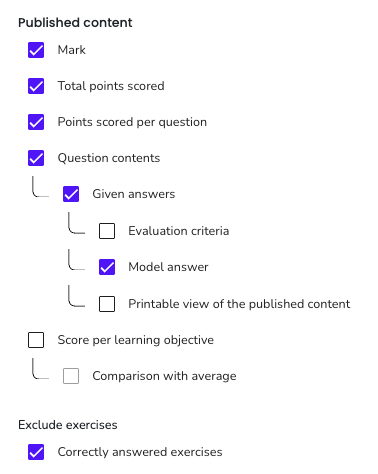

# Checklist for Running a Digital Exam

(Last updated: Apr 8, 2025)

This document is created by Yen-Chia Hsu when running the data science course for the Bachelor Information Science program (Informatiekunde), based on personal experiences and also the university's [invigilation protocol](https://datanose.nl/#docentensite/examination-practical/invigilation).

A digital exam means that students take the exam using software tools.
The exam is typically conducted in a physical room with computers.
This document explains what to do before, during, and after digital exams.
This document also assumes that the digital exam uses the [ANS](http://ans.app/) tool.
The target audience for this document include course coordinators and teaching staff members.

**Important: this document is created in the context of the Informatics Institute under the Bachelor Information Science program (Informatiekunde). The situation may be different if you teach in another faculty or in another program.**

### Table of Content

- [Who to Contact](#contact)
- [Exam Planning](#planning)
- [Long Before the Exam](#long-before)
- [Just Before the Exam](#just-before)
- [During the Exam](#during)
- [After the Exam](#after)
- [Other Notes](#other)

## Who to Contact

Below are two emails that are important in the communication of exam settings:
- The exam desk (search "tentamenbureau-fnwi" in UvA's Microsoft Outlook App for the email)
- The digital test office (search "digitaletoets-fnwi" in UvA's Microsoft Outlook App for the email)

Generally speaking, the exam desk deals with matters related to the physical room (e.g., invigilators hiring), and the digital test office deals with issues related to the software that will be used during the exam (e.g., ANS, Jupyter Notebook). In the following checklist, we refer to these emails using their names (i.e., the exam desk, or the digital test office).

## Exam Planning

- [x] Communicate with the digital test office about any required computer settings (e.g., ANS, Jupyter Notebook) and ask them to make a request to the ICT office to set the software tools correctly. Special requests need to be done a couple of months ahead (e.g., using a specific software during the exam). Usually, the digital test office will email the course coordinator for confirmation.
- [x] About one month before the exam, the exam desk will contact the course coordinator by email. Communicate with the exam desk to hire invigilators (normally, 1 invigilator per 50 students). If it is a resit, it looks like the exam desk will not ask automatically, so we need to request invigilators by email. The exam desk will also provide the attendance list upon request.

## Long Before the Exam

Communication:
- [x] Make an announcement on Canvas to explain what will be covered in the exam (e.g., the range of course materials), the type of questions (e.g., multiple-choice questions, open-ended questions, coding questions), and what software tools that students will/can use during the exam (e.g., ANS, Jupyter Notebook).
- [x] If there are multiple partial exams, and the second (or any follow-up) exam will be harder than the first one, make an announcement on Canvas to remind students that the exam will be more difficult than the previous one.
- [x] If there are multiple-choice questions and [guess correction](https://support.ans.app/hc/en-us/articles/360014340098-Guess-correction) will be enabled, communicate with the students about this using a Canvas announcement.
- [x] Make an announcement on Canvas to emphasize that there is no Internet access during the exam.

Optional:
- [x] Provide a suggested study plan for the students to prepare exams (e.g., re-watch lecture recordings, review course slides, redo assignments, prepare one page cheatsheet, etc).
- [x] If a student has conflicts in scheduling exams, one solution is to have the student take two (or multiple) exams together in one location. In this situation, ensure that the digital test office has communicated this well with the exam desk to allocate a desk for the student to stay longer. There is a chance that the people on site does not know the situation due to a lack of communication.

## Just Before the Exam

Communication:
- [x] Make an announcement on Canvas to remind students of the following information:
  - They must bring a valid ID (student ID card or other government-issued ID) to the exam location.
  - They are allowed to enter the exam room only up to 30 minutes past the exam starting time.
  - They are not allowed to leave the exam room during the first 30 minutes and last 15 minutes of the normal exam schedule. The purpose of the rule is to prevent fraud (during the first 30 minutes) and disturbance (during the last 15 minutes).

Exam materials:
- [x] When designing the ANS questions, have a description at the end of the test to indicate that this is the end of the exam. The purpose is to improve exam clarity.
- [x] Optionally, ask someone (a person that can check the exam materials) to review the exam materials and provide feedback for improvement.
- [x] Set a password on ANS so that students can start at the same time. The password setting can be found on `Settings -> Accessibility -> Access`.
- [x] Set the correct mark calculation by going to `Settings -> Mark calculation`. The marking formula should be `1 + 9 * obtained_points / total_points`. Set the pass mark to `5.5`. Guess correction is recommended to be enabled (also with the "Limit the guess correction to zero" option enabled). Typically, set the lowest mark limit to `1` (which is the base grade), and set the highest mark limit to `10`. Also, set the rounding to `**two decimal**`.
- [x] Have the exam materials ready online on ANS and email them to the digital test office 7 days before the exam date. Ask the digital test office to schedule the exam time slots on ANS and check if the digital exam setting is correct.

Sanity checks:
- [x] Check if the time slots that the exam team scheduled for the exam matches the listed exam time on [datanose](https://datanose.nl).
- [x] Check the list of students with extra exam time, which will be provided by the exam desk by email. Then, make sure that on the attendance list, their name has a star-shaped symbol (\*) after it so that the invigilators know that these students have extra time during the exam. If there are missing star-shaped symbols, add them manually to the attendance list.
- [x] The digital test office will schedule a time slot on ANS for the exam with location restrictions. Check if the students who have time extensions are actually in the time slot with extensions. If not, email the digital test office and ask them for help resolving the problem.

Other actions:
- [x] Print `N+1` copies of the attendance list and bring them to the exam location, where `N` is the number of invigilators. We need to give them to the invigilators. You can get the attendance list from DataNose. First log in to DataNose, click the `Course record` block at the top of the page (near the language selection part), click the exam (e.g., "Tentamen digitaal 1") under `Assessment overview` section, and finally click on the small `Generate` link under the `Documents` section.

Optional:
- [x] If this is the final exam, get the digital course evaluation form ready before the exam. You should get an email from "UvA Q Studentfeedback" to adjust the digital form. If there is a problem, email <opleidingsassistent-iw-science@uva.nl>.

## During the Exam

Be there at the exam location **at least 45 minutes early** before the exam starting time.

Communicate the following to the invigilators:
- [x] Have all the students with extra time sitting in the row that is as far away from the entrance as possible to prevent them from being disturbed.
- [x] Explain when and how to check student ID. Typically, having the student ID card is sufficient to check if the ID number matches the one on the attendance list. It is better if students bring government-issued IDs.
- [x] Give the student attendance list to the invigilators. Ask invigilators to just put a checkmark on the attendance list after checking the ID. Do not ask students to sign the list when they are working on the exam. In this way, we minimize disturbance to students.
- [x] For physical exams, explain that students need to sign the attendance list when they finish the exam before leaving the room. For digital exams, this is not really necessary because attendance is automatically registered on the digital exam system (such as ANS).
- [x] Explain the allowed/disallowed items for students to bring to the exam, such as a one-page cheatsheet.
- [x] Let students enter the exam room about 15 minutes before the exam starts officially. In this way, the staff members on site can help students deal with login problems.
- [x] Explain the policy for students to go to the toilet during the exam. My suggestion is to allow students to do that, but an invigilator needs to accompany the student.

Communicate the following to the technical support people:
- [x] Explain the software (e.g., Jupyter Notebook) that is needed for the exam and check if it is set correctly on the computer before the exam starts.

Other actions:
- [x] Give students the password on ANS right before the exam starts using the microphone in the exam room.
- [x] Explain the exam rules to the students, such as the time that they can leave the room, toliet visits, raising hand if there is a question, allowed items, etc.

Problem handling:
- [x] If a student should have extra time but is not set correctly, email the digital test office and ask them for help resolving the problem. Or we can just log in to ANS and manually add students to the time slots with extra time (go to `Taking -> Timeslots` to select a time slot and add a student by name or student ID number).
- [x] If a student cannot log in to the exam computer, ask the technical staff members on site to help the student log in to their computer.
- [x] For any other problems that we are not sure how to solve, email the digital test office and the exam desk with an "urgent" tag in the email title. Usually the digital test office and the exam desk reply fast during the exam time.
- [x] If a student has a problem logging in to ANS, email the digital test office and ask them to create a temporary password for the student to log in. The password is only valid for a short time (roughly 15 minutes). You can also do this by yourself (go to `Taking -> Participants` and click on the three dots button near the student name).
- [x] If students can log in to ANS but do not see the exam, we can manually add them to the ANS system by searching their student ID. This can be done by clicking the timeslot in ANS and clicking on the "Add learner" button. But if the student ID number (or name) does not appear on the ANS system, email the digital test office to ask them to resolve the problem.
- [x] The general rule is that we cannot allow students to enter the exam room after 30 minutes. However, there is a chance that students can take the exam after 30 minutes if they are very late, providing that nobody has left the room (which means no possibility of exchanging information). In this case, allow the student to do the test but communicate with the student that the exam can be invalid (which may need approval). Later, email the program coordinator/director to report the case and ask for approval.
- [x] If the Jupyter Notebook icon on the desktop is missing, or the Jupyter Notebook icon is there but nothing happens after clicking on it, tell the technical support to fix that. It could be the problem that students are not logged in using their own account (sometimes the technical support people just log everyone in general), and there seems to be some weird permission problems in using software if logged in this way.
- [x] If someone forgets to bring ID cards, one option is to still allow the student to take the exam and ask the student to present the ID cards later (e.g., in lectures).
- [x] If the Jupyter Notebook software is not working, it could be the reason that the technical staff is using a non-guest account when logging into the computer, or it could be some permission setting issues that need rebooting of all machines in the room.

Optional:
- [x] If this is the final exam, tell the students to also complete the digital course evaluation form after the exam.

## After the Exam

Grading related:
- [x] Within some working days (typically 20), release the grade on Canvas and tell students how they can inspect their grade by making an announcement on Canvas. Check the [OER](https://student.uva.nl/en/topics/assessment-of-your-grade-point-average) to know the exact number of days that are allowed for processing the grade. If you need to display the grade on the Canvas gradebook (not calculating the final grade), one option is to [export the grade first from ANS](https://support.ans.app/hc/en-us/articles/360036410294-Export-results), and then [import the grade to Canvas](https://canvas.uva.nl/courses/169/pages/using-the-gradebook?module_item_id=1237607#Import_Grades). To export ANS grade, go to `Results -> Export`. To import the grade to Canvas, go to `Settings -> Navigation` to make sure that the `Im/export grades` tab is enabled, then go to that tab to import the grade (notice that Safari does not work for this, but Google Chrome works).
- [x] Based on the [OER](https://student.uva.nl/en/topics/assessment-of-your-grade-point-average), all the partial grades should not be rounded when being used to calculate the final grade. So this means that we need to go to Canvas and [import the ANS test results directly](https://canvas.uva.nl/courses/169/pages/final-grades-import-results-from-testvision-sowiso-ans-and-excel#Toetsresultaten). Importing the grade this way will prevent ANS from rounding the grade. Do not output the grade to CSV and then import the CSV to Canvas for calculating the final grade, which will have the rounding problem.
- [x] If there is a problem in some questions that you need to adjust the grade, use the review feature on ANS to do so (see the "Adjustments to the grading scheme" section on [this page](https://support.ans.app/hc/en-us/articles/360033652094-Start-reviewing)).

There are several ways for students to inspect their grades, and some examples are listed below:
- Grade inspection without supervision: schedule a time slot using ANS to open the exam for a time period that allows students to inspect their exam grades, questions, and answers online. This can be done by going to the ANS system and selecting `Settings -> Publication -> Add timeslot`. Communicate with the student how they can ask questions, for example, by scheduling a meeting with the course coordinator. An example of the ANS grade publication setting is below:  
- Grade inspection with supervision: email the program coordinator to ask for help reserving a physical room for grade inspection during a specific time. Students can come to the room to access the exam materials and grades, as well as ask questions during the scheduled time.

## Other Notes

When in doubt, check the [UvA Teaching and Examination Regulations](https://student.uva.nl/onderwerpen/onderwijs-en-examenregelingen-oer) or ask the program director/coordinator.
